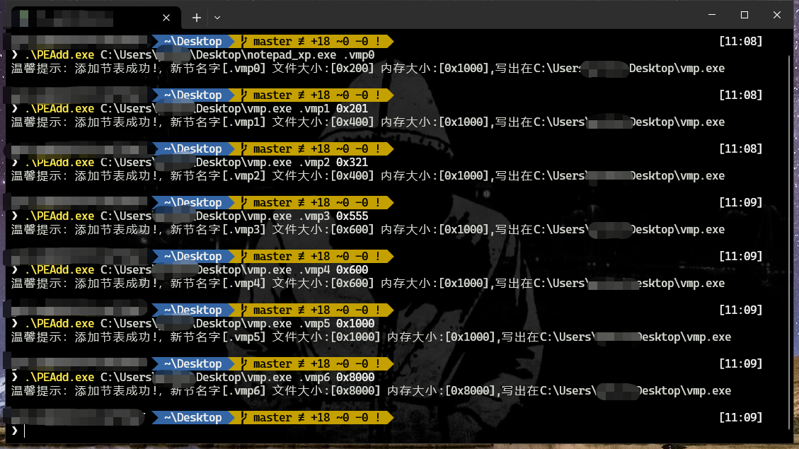
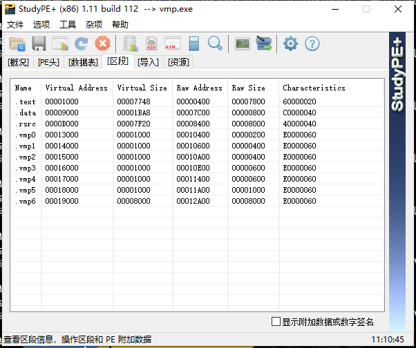

## 简介：

```
██████╗ ███████╗    ██╗  ██╗ █████╗  ██████╗██╗  ██╗
██╔══██╗██╔════╝    ██║  ██║██╔══██╗██╔════╝██║ ██╔╝
██████╔╝█████╗      ███████║███████║██║     █████╔╝
██╔═══╝ ██╔══╝      ██╔══██║██╔══██║██║     ██╔═██╗
██║     ███████╗    ██║  ██║██║  ██║╚██████╗██║  ██╗
╚═╝     ╚══════╝    ╚═╝  ╚═╝╚═╝  ╚═╝ ╚═════╝╚═╝  ╚═╝
                     From PTU&三进制安全 Team. VxerLee
```

**学习滴水逆向 PE结构分析代码练习  
海东老师 Bilibili：滴水逆向三期  
PE结构分析类，可读取PE文件，解析PE头，解析节表，目录表 以及输入导出表。**  

## 调用类

我将PE解析封装成了类(PE.h PE.cpp)，调用方式默认只要在构造函数里面传入一个路径参数即可，然后调用PrintAll打印输出所有信息。

```c++
//包含PE解析类头文件
#include "PE.h"

int main(int args,char *argv[])
{
    //判断参数是否正确.
    if(args<2)
        return 0;
    //构造PE类，参数为路径 或者buffer
    PE pe = PE(argv[1]);
    //调用PrintAll() 输出所有信息。
    pe.PrintAll();
    return 0;
}
```

添加节（调用Add_Section函数，参数：节名、目标输出文件、节大小）

```c++
//包含PE解析类头文件
#include "PE.h"
#include <Shlobj.h>
int strtoi(const char* str, int base)
{
    int res = 0, t;
    const char* p;
    for (p = str; *p; p++) {
        if (isdigit(*p)) {
            t = *p - '0';
        }
        else if (isupper(*p)) {
            t = *p - 'A' + 10;
        }
        else {
            return -1;
        }

        if (t >= base) return -1;
        res *= base;
        res += t;
    }
    return res;
}

int main(int args, char* argv[])
{
    //判断参数是否正确.
    if (args < 3)
    {
        usage();
        return 0;
    }
    //构造PE类，参数为路径 或者buffer
    PE pe = PE(argv[1]);

    //获取桌面路径
    const char* secname = argv[2];
    char destPath[255];
    SHGetSpecialFolderPathA(NULL, destPath, CSIDL_DESKTOPDIRECTORY, FALSE);
    wsprintfA(destPath, "%s\\vmp.exe", destPath);

    int nsize = 0;
    if (argv[3] == NULL)
    {
        pe.Add_Section(secname, (char*)destPath);
    }
    else
    {
        if (strstr(argv[3],"0x"))
        {
            string tmp = argv[3];
            string num = tmp.substr(2, tmp.length() - 2);
            nsize = strtoi(num.c_str(), 0x10);
        }
        else
        {
            nsize = strtoi(argv[3], 10);

        }
        pe.Add_Section(secname, (char*)destPath, nsize);
    }


    return 0;
}
```


## 截图

 
 
 

 

 

 
